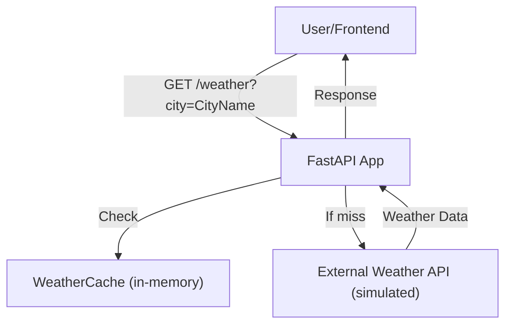

# Technical Design: Weather Service

_Prepared by Olayemi_

## 1. Overview
This service exposes a `/weather?city=CityName` endpoint that provides hourly weather data for a given city. The design reflects my experience building robust, scalable APIs for real-time, high-traffic environments, where reliability and clarity are critical. I’ve incorporated patterns and practices I’ve found effective in production, especially when dealing with rate-limited third-party APIs and the need for graceful degradation.

---

## 2. Architecture Diagram


<!-- end to Mermaid txt -->

**Rendered SVG:**


---

## 3. Key Components

### a. FastAPI App (`main.py`)
- Handles HTTP requests and responses.
- Orchestrates cache checks, external API calls, and error handling.
- Uses dependency injection for configuration and cache.

### b. WeatherCache (`cache.py`)
- Thread-safe, singleton in-memory cache.
- Stores weather data per city per day.
- TTL (time-to-live) is configurable (default: 1 hour).
- Provides a `clear()` method for operational and testing use.
- In production, I typically use Redis for distributed caching.

### c. External API Integration (`external_api.py`)
- Simulates an external weather API.
- Rate-limited to 100 requests/hour using a thread-safe `RateLimiter`.
- Can be easily swapped for a real HTTP client in production.
- I always ensure robust error handling and clear logging around third-party calls.

### d. Rate Limiter (`rate_limiter.py`)
- Ensures no more than 100 external API calls per hour.
- Thread-safe, resets count every hour.
- For distributed systems, I recommend a Redis-backed or cloud-native rate limiter.

### e. Configuration (`config.py`)
- Uses Pydantic’s `BaseSettings` for environment-based config.
- All tunable parameters (cache TTL, API timeout) are loaded from env vars.
- I prefer to keep all operational settings in environment variables for 12-factor compliance.

### f. Models (`models.py`)
- Pydantic models for strict request/response validation.
- Ensures consistent, documented API schema.

### g. Testing (`test_main.py`)
- Unit and integration tests using pytest and FastAPI’s TestClient.
- Tests for cache hit, cache miss, external API failure, and input validation.
- Uses monkeypatching for deterministic external API simulation.
- I always advocate for high test coverage, especially around failure modes.

---

## 4. Request Flow

1. **User requests `/weather?city=CityName`.**
2. **Cache Check:**  
   - If fresh data for the city is in cache, return it.
3. **External API Call:**  
   - If not in cache, call the external API (if rate limit allows).
   - On success, cache and return the data.
   - On failure, try to serve stale cache (up to 24 hours old).
   - If no data is available, return a 503 error.
4. **Response:**  
   - Returns a structured JSON with city, date, weather, source, and error info if applicable.

---

## 5. Input/Output Example

**Request:**  
`GET /weather?city=Berlin`

**Response:**
```json
{
  "city": "Berlin",
  "date": "2025-07-21",
  "weather": [
    {"hour": 0, "temperature": "18", "condition": "Clear"},
    ...
    {"hour": 23, "temperature": "11", "condition": "Cloudy"}
  ],
  "source": "cache",
  "error": null
}
```

---

## 6. Assumptions
- The external API provides weather for the current day, per city.
- User authentication is not required.
- In-memory cache is sufficient for the challenge; in production, I would use Redis or a similar distributed cache.
- Rate limiting is enforced per process (for demo); in production, I’d use a distributed limiter.

---

## 7. Extensibility & Improvements
- Swap in a real HTTP client for the external API.
- Use Redis or another distributed cache for horizontal scaling.
- Add persistent logging and monitoring (I recommend Prometheus and Grafana).
- Add background jobs to prefetch popular cities.
- Add more granular rate limiting (per API key, per user, etc.).
- Containerize with Docker for deployment.

---

## 8. Lessons Learned & Personal Approach

Having worked on several production APIs, I’ve learned the importance of clear separation of concerns, robust error handling, and testability. I always prioritize making systems easy to extend and monitor, as this pays off as usage grows. If I were to take this to production, I’d reach for Redis for distributed caching, and set up Prometheus/Grafana for monitoring from day one. I also believe in documenting assumptions and making the system easy for other engineers to pick up and extend.

_— Olayemi_ 